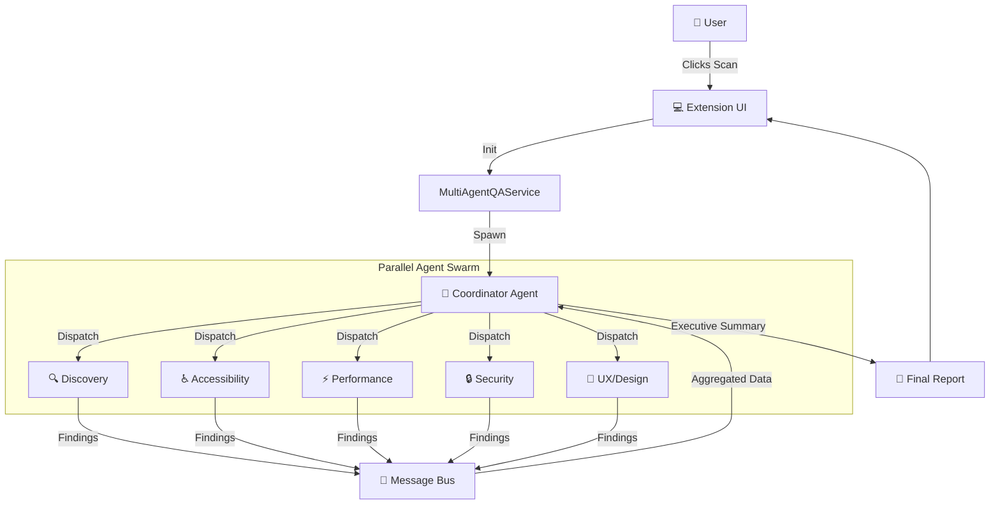
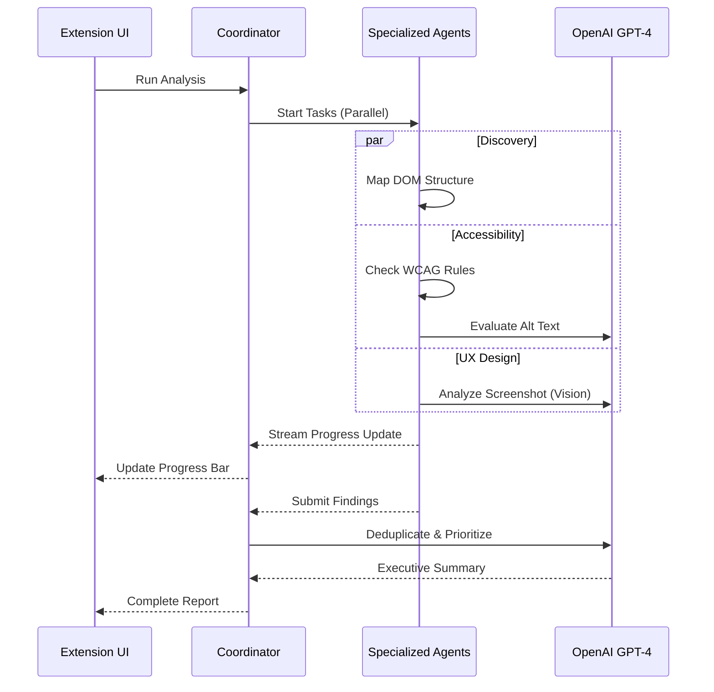

# 🤖 Visual QA Agent (Multi-Agent System)

A powerful, autonomous Chrome Extension that uses a **Cursor-inspired Multi-Agent Architecture** to audit web pages for bugs, accessibility issues, security vulnerabilities, and UX flaws in seconds.

  

---

## 🚀 Features

- **Multi-Agent Orchestration**: 5 specialized AI agents run in parallel.
- **Real-Time Analysis**: Watch agents work live via the extension sidebar.
- **AI-Powered Insights**: Uses GPT-4o and GPT-4 Vision to detect issues rule-based scanners miss.
- **Comprehensive Coverage**:
  - 🔍 **Discovery Agent**: Maps DOM structure and interactive elements.
  - ♿ **Accessibility Agent**: WCAG 2.1 compliance + AI alt text validation.
  - ⚡ **Performance Agent**: Core Web Vitals & resource optimization.
  - 🔒 **Security Agent**: Vulnerability scanning (XSS, mixed content).
  - 📱 **UX Agent**: Visual hierarchy and mobile responsiveness (Vision AI).
- **Executive Summary**: The **Coordinator Agent** synthesizes all findings into a prioritized action plan.

---

## 📊 System Architecture

### 1. High-Level Flow
The system uses a **Coordinator-Worker** pattern. The Coordinator Agent spawns specialized agents, manages the message bus (pub/sub), and synthesizes the final report.



### 2. Analysis Workflow



---

## 🛠️ Installation Instructions

### Prerequisites
- Node.js (v16+)
- OpenAI API Key

### 1. Clone & Build
```bash
git clone https://github.com/yourusername/visual-qa-agent.git
cd visual-qa-agent

# Install dependencies
npm install

# Build the extension (creates /dist folder)
npm run build
```

### 2. Load into Chrome
1. Open Chrome and navigate to `chrome://extensions/`.
2. Toggle **Developer mode** (top right).
3. Click **Load unpacked**.
4. Select the **`dist`** folder (inside the project directory).
   > ⚠️ **Important:** Do NOT select the root folder. Select `dist`.

### 3. Setup
1. Click the **Visual QA Agent** icon in your toolbar (or use `Alt+Shift+T`).
2. Go to the **Settings** tab.
3. Enter your **OpenAI API Key** and click Save.
4. Go to **Test** tab and click **"🚀 Run Multi-Agent Scan"**.

---

## 🎮 Development

The project is structured as a Vite + React application.

- `src/services/agents/` - Contains all agent logic.
- `src/components/` - React UI components.
- `manifest.json` - Chrome Extension configuration.

**Adding a New Agent:**
1. Create `src/services/agents/newAgent.ts` extending `Agent`.
2. Implement `analyze()` method.
3. Register in `MultiAgentQAService`.

---

## 📄 License
MIT
